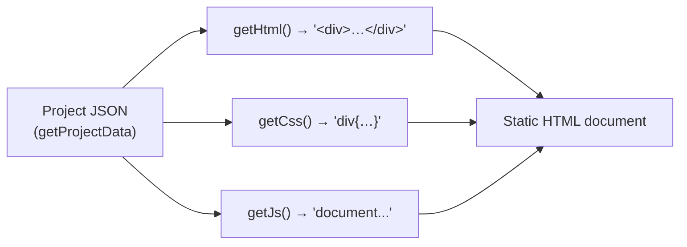
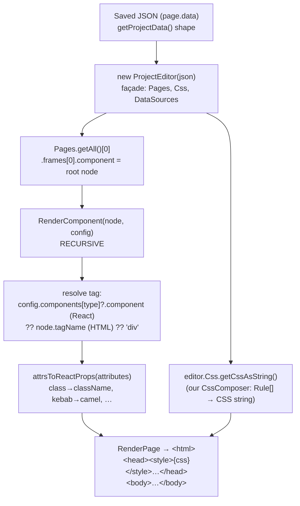

# Rendering the JSON: GrapesJS Canonical vs Our React Renderer

How a stored page becomes HTML — what GrapesJS gives you out of the box, why we
don't use it for the public render, and what we do instead.

> Companion docs: [`rendering-pipeline.md`](../reference/rendering-pipeline.md) (the full
> route/DB/template-resolution flow) and [`theming-guide.md`](./theming-guide.md)
> (how theme CSS is layered on top).

---

## What GrapesJS gives you canonically

GrapesJS is built around **one source of truth: the project JSON.**

```js
const data = editor.getProjectData()   // { pages: [...], styles: [...], assets, dataSources, ... }
editor.loadProjectData(data)           // restore the editor from it
```

This is the *only* thing GrapesJS guarantees you can round-trip. From the docs:

> You should **only** rely on the JSON project data to load your project. The
> editor can parse HTML/CSS, but never rely on it as a persistence layer — much
> information gets stripped off.

So `getProjectData()` is what we **store** (see the `tc-storage-adapter` and the
DB `data`/`draftData` columns). The JSON holds the component tree, the style
rules, assets, and data sources — but **not** rendered HTML/CSS.

For *output*, GrapesJS offers three string exporters:

| Method | Returns | Notes |
|---|---|---|
| `editor.getHtml({ component })` | HTML string for a page/component | Flattened markup — no React, no component identity |
| `editor.getCss({ component })` | CSS string | Serialized from the style rules |
| `editor.getJs()` | JS string | Concatenated component `script`s, for runtime behavior |

The canonical "export a site" recipe is to walk the pages and call these — e.g.
the docs' `onStore` example builds `pagesHtml` with
`editor.getHtml({ component })` + `editor.getCss({ component })` per page.



That produces a **static HTML string**. Fine for a plain export — but it's a
dead end for our stack.

---

## Why we use our own React renderer instead

Our pages aren't just markup. A node like `{ type: "cta-section" }` is meant to
render as a **real React component** (`CtaSection`) — a server component that may
fetch data, take typed props, and compose other components. `getHtml()` can only
ever give us a frozen string of whatever that component looked like *inside the
editor canvas*. That loses everything that makes the component a component.

Concretely, `getHtml()/getCss()` fall short for us because:

1. **No React component mapping.** We need `type → React component`, not a
   string. Pattern components (`lib/plugins/patterns`) are real RSCs; HTML
   export can't reconstruct them.
2. **No RSC / server-side data.** A flattened string can't run server logic,
   `async` fetches, or props.
3. **It ships GrapesJS to render.** Calling `getHtml` requires a live editor
   instance. We want to render on the server (Next.js route handlers / RSC)
   **with no GrapesJS at runtime** — GrapesJS is editor-only.
4. **Type safety + control.** We own attribute conversion (`class`→`className`,
   `for`→`htmlFor`, kebab→camel), CSS ordering, error states, and the
   page/component split.

So we wrote `lib/plugins/react-renderer/` — a homegrown port of the
`@grapesjs/studio-sdk-plugins/rendererReact` plugin, minus the Studio
licensing/event-bus bits. It has **two halves**:

- **Editor half** (`react-renderer/`, `index.ts`) — a GrapesJS plugin that lets
  component *definitions* be JSX and mounts a React root into the canvas iframe
  via `Canvas.config.customRenderer`. This is what authors see while editing.
- **Project half** (`react-renderer/project/`) — a standalone renderer that
  takes the saved JSON and produces a React tree **outside** the editor, for SSR
  and static emission. **No GrapesJS dependency.** This is the public render.

---

## How a page is rendered (the project renderer)

The project half re-implements just enough of the `editor` surface to read the
JSON, then recurses it into React.



Step by step:

1. **`new ProjectEditor(json)`** (`project/project-editor.ts`) — a thin façade
   that mirrors the bits we need from the live editor: `Pages`, `Css`,
   `DataSources`. It does **not** use GrapesJS.
2. **CSS** — `editor.Css.getCssAsString()` runs our own `CssComposer`
   (`project/css-composer.ts`), which serializes the `styles[]` rule array to a
   CSS string (grouping/ordering `@media`, `@keyframes`, pseudo-rules). This is
   the analogue of canonical `getCss()`, reimplemented as pure data.
3. **Pick the root** — first page → first frame → `frame.component` is the root
   node (with `head` and `docEl` siblings for the document shell).
4. **`RenderComponent`** (`project/render-component.tsx`) recurses the tree. For
   each node it resolves a tag in priority order:
   `config.components[type]` (a registered **React** pattern component) →
   `node.tagName` (intrinsic HTML) → `div`. Attributes are converted to React
   props by `attrsToReactProps`; children recurse.
5. **`RenderPage`** (`project/render-page.tsx`) assembles the document:
   `<html>` (from `docEl.tagName`), a `<head>` containing the page CSS inlined as
   `<style>{css}</style>`, and the `<body>` component tree. Render whole-page, or
   pass a `componentId` to render just one subtree with the CSS inlined.

The result is a normal React tree — Next.js renders it as a server component. No
`getHtml`, no `getJs`, no live editor.

> **Where `getJs` went:** we don't emit a JS bundle from component `script`s.
> Interactivity comes from the React pattern components themselves (client
> components where needed), not from GrapesJS-serialized scripts.

---

## One-line summary

GrapesJS persists **JSON** (`getProjectData`) and can *export* flat
**HTML/CSS/JS** strings (`getHtml`/`getCss`/`getJs`) — but flat strings throw
away our React component identity and need a live editor. So we store the JSON
and run our **own `project/` renderer** that maps each node's `type` to a real
React component (or HTML tag), serializes the styles with our own `CssComposer`,
and renders the page server-side with no GrapesJS at runtime.
