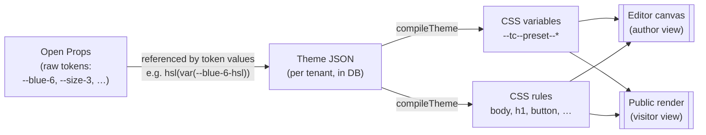
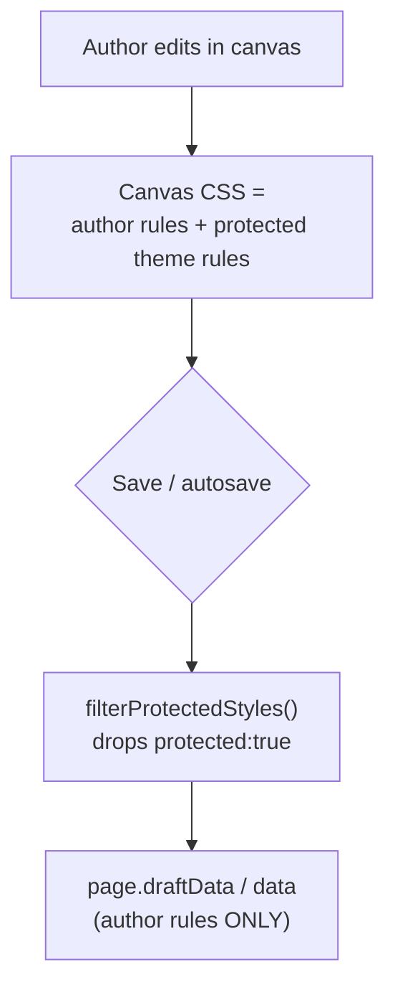

# Theming — A Developer's Guide

If you're new to this codebase and need to understand how pages get their look,
start here. This doc explains **how theming works**, **how Open Props fits in**,
and **what you need to know before touching any of it**.

It's the on-ramp. When you want the deep detail on one piece, the focused docs
are linked inline:

- [`theme-document.md`](../reference/theme-document.md) — the theme JSON shape, field by field
- [`rendering-pipeline.md`](../reference/rendering-pipeline.md) — how stored JSON becomes HTML
- [`preview-theme-css-flow.md`](../reference/preview-theme-css-flow.md) — the theme-CSS HTTP request path
- [`css-publish-architecture.md`](../reference/css-publish-architecture.md) — internal vs external CSS at publish time

---

## The one-paragraph version

Each **tenant** owns one **theme** — a JSON document (modeled on WordPress's
`theme.json`) describing their colors, fonts, spacing, and default element
styles. That JSON **compiles to CSS custom properties** (`--tc--preset--color--primary`,
…) plus a handful of CSS rules (`body`, `h1`–`h6`, buttons, …). The raw values
those tokens point at come from **Open Props** — an off-the-shelf design-token
library that is the baseline palette/scale for the whole app. The compiled theme
CSS is injected into the GrapesJS editor canvas (so authors see their brand
live) and served as a cached stylesheet on the public render (so visitors see
it). Pages themselves never store theme CSS — they inherit it by reference.



---

## Part 1 — How theming works

### A theme is one JSON document per tenant

The `Tenant` row in Postgres has two relevant columns
(`prisma/schema.prisma`):

```prisma
model Tenant {
  // …
  theme        Json @default("{}")  // the full Theme document; {} = use bundled default
  themeVersion Int  @default(1)     // bumped on every theme write — used as a cache key
}
```

The shape of that JSON is defined in `lib/theme/schema.ts`:

```ts
type Theme = {
  version: ThemeVersion
  settings: TokenRegistry  // the design tokens (palette, type, spacing, …)
  styles?: StyleDefaults   // how things look by default (body, headings, buttons)
  custom?: CustomTree      // escape hatch: arbitrary CSS variables
}
```

Two halves do different jobs:

- **`settings`** is the *registry of ingredients* — a named palette, font
  families, spacing scale, etc. Defining a token here does **not** apply any
  styling; it just makes the token available.
- **`styles`** is *how those ingredients get used by default* — e.g. "headings
  use the heading font and bold weight", "buttons use the primary color".

> Field-by-field walkthrough lives in [`theme-document.md`](../reference/theme-document.md).
> Read it before adding a new token category.

When a tenant's `theme` is `{}`, the app falls back to `defaultTheme` in
`lib/tokens/index.ts` — a bundled blue + system-sans starter theme.

### Compilation: JSON → CSS

`lib/theme/compile.ts` turns the theme document into something a browser can
use. `compileTheme(theme)` returns:

- **`rootVars`** — the `:root` custom properties. Naming mirrors WordPress:
  - `--tc--preset--<category>--<slug>` for registered tokens
    (e.g. `--tc--preset--color--primary`, `--tc--preset--spacing--md`)
  - `--tc--custom--<segment>--<segment>` for the `custom` escape-hatch tree
- **`rules`** — scoped CSS rules from `styles`: root defaults land on `body`,
  `styles.elements.heading` expands across `h1`–`h6`, and
  `styles.components.<type>` targets `[data-gjs-type="<type>"]`.

Inside the JSON, a value can *reference* a token instead of hardcoding it:

```
var:preset|color|primary   →  var(--tc--preset--color--primary)
var:custom|line-height|md   →  var(--tc--custom--line-height--md)
anything-else               →  passes through unchanged
```

Font sizes can be fluid — `{ value, fluid: { min, max } }` compiles to
`clamp(min, value, max)`.

`compiledThemeToCss(compiled)` then flattens that into a plain CSS string for
server-side rendering.

### Where the compiled theme is applied

**In the editor (live):** `lib/plugins/design-system-plugin.ts` compiles the
theme and injects the variables and rules into the GrapesJS canvas via
`editor.CssComposer.setRule(...)`. It subscribes to the `themeStore`
(`lib/theme/theme-store.ts`), so when an author edits a token, the canvas
re-renders immediately. On editor `load` it also re-hydrates the theme from any
stored `:root` it finds (`tokensFromStored` in `lib/tokens/index.ts`).

**On the public render (cached):** the preview layout injects a
`<link>` to `/api/preview/theme/{tenantId}/{version}/theme.css`. That route
(`app/api/preview/theme/.../route.ts`) reads the tenant theme, runs
`compileTheme` → `compiledThemeToCss`, and returns it `immutable` with a
1-year cache. The `{version}` segment is `Tenant.themeVersion`, so a theme edit
bumps the version → new URL → cache busts cleanly. Full request walkthrough:
[`preview-theme-css-flow.md`](../reference/preview-theme-css-flow.md).

### Protected rules — why theme CSS isn't baked into pages

This is the single most important invariant to understand, and the one most
likely to trip you up.

The theme rules injected into the canvas are flagged **`protected: true`**.
When a page is saved, `lib/plugins/tc-storage-adapter.ts` runs
`filterProtectedStyles(...)` and **strips every protected rule before writing**.

Why: the tenant theme must be the *single source of truth*. If theme CSS were
saved into each page's JSON blob, every page would carry a frozen copy of the
brand, and a theme change wouldn't propagate. By filtering protected rules out
on save, pages stay theme-agnostic and inherit the current theme by reference at
render time.

The same `protected` mechanism is reused for synced-template styles — see §7 in
[`templates-followups.md`](../reference/templates-followups.md). The rule of thumb:
**rules the author authored persist; rules the system injected are protected and
must not persist.**



---

## Part 2 — How Open Props is used

[Open Props](https://open-props.style) is a library of plain CSS custom
properties — a ready-made palette and scale (`--blue-6`, `--size-3`,
`--font-sans`, `--radius-2`, …). We use it as **the design-system baseline**.
Tripcart's own tokens don't reinvent values; they *point at* Open Props
variables.

It's pinned in `package.json`: `"open-props": "^1.7.23"`.

Open Props shows up in **four** distinct places, and it's worth knowing why each
exists:

### 1. Loaded into the outer React app

`app/layout.tsx`:

```ts
import "open-props/open-props.min.css"
import "open-props/colors-hsl.min.css"
```

This makes Open Props variables resolve in the admin/editor chrome itself —
preset swatches, panel previews, etc. It is the design system's source of truth
for the React UI.

### 2. Loaded into the GrapesJS canvas iframe

The canvas is a separate iframe, so it needs its own copy. `editor-shell.tsx`
points the canvas at vendored URLs:

```ts
const CANVAS_STYLE_URLS = [
  "/vendor/open-props-sizes.min.css",
  "/vendor/open-props-fonts.min.css",
  "/vendor/open-props-borders.min.css",
  "/vendor/open-props-colors-hsl.min.css",
]
```

Those files are copied out of `node_modules` into `public/vendor/` by
`scripts/sync-vendor-css.mjs`, which runs on `predev` / `prebuild` /
`postinstall`. The point is a **stable, framework-agnostic URL** the iframe can
load — the same way the public render references external CSS rather than
inlining it (see [`css-publish-architecture.md`](../reference/css-publish-architecture.md)).

> If the canvas suddenly renders with no spacing/colors, check that
> `public/vendor/*.css` exists — i.e. that the sync script ran.

### 3. Token values reference Open Props

`lib/tokens/index.ts` defines the bundled defaults, and the values are
Open Props expressions:

```ts
// colors  → hsl(var(--blue-6-hsl)), hsl(var(--gray-0-hsl)), …
// spacing → var(--size-1) … var(--size-10)
// fonts   → var(--font-sans), var(--font-weight-3), var(--font-size-0), …
// border  → var(--border-size-1), var(--radius-1), var(--shadow-1)
```

So the resolution chain at runtime is:

```
component uses  --tc--preset--color--primary
   → theme sets it to  hsl(var(--blue-6-hsl))
      → Open Props defines  --blue-6-hsl
```

Three layers: **author-facing token → tenant theme value → Open Props baseline.**

### 4. Token pickers in the Style Manager

`components/page-builder/style-fields/open-props-tokens.ts` imports Open Props'
raw token maps straight from source and filters them into a `TOKENS` list that
populates the editor's dropdowns (size, font-size, weight, line-height, radius,
color, …):

```ts
import sizeTokens from "open-props/src/sizes"
import fontTokens from "open-props/src/fonts"
import borderTokens from "open-props/src/borders"
import colorTokens from "open-props/src/props.colors-hsl.js"
```

This is why an author picking "spacing" or "radius" sees a curated set of
Open Props steps rather than a free-text box.

### The Tailwind bridge

We use Tailwind v4 (no `tailwind.config.*` — config lives in `app/globals.css`
via `@theme`). The `@theme inline` block bridges theme tokens into Tailwind
utilities so app components can use Tailwind classes that still respect the theme:

```css
@theme inline {
  --font-heading: var(--tc--preset--font-family--heading, "Inter Variable", sans-serif);
  --color-primary: var(--primary);
  --radius-lg: var(--radius);
  /* … */
}
```

So there are effectively two consumers of the tokens: **authored pages**
(via the compiled `--tc--preset--*` variables) and **the admin UI**
(via Tailwind utilities mapped in `@theme`).

---

## Part 3 — What a new developer needs to understand

A short list of the things that aren't obvious from reading any single file:

1. **Three layers of tokens, in order.** Author-facing preset
   (`--tc--preset--color--primary`) → tenant theme value → Open Props baseline
   (`--blue-6-hsl`). Don't hardcode a hex where a token belongs; trace which
   layer you actually mean to change.

2. **The theme is per-tenant and lives in the DB, not in code.** `defaultTheme`
   in `lib/tokens/index.ts` is only the fallback when `Tenant.theme` is `{}`.
   Editing it changes the *starter*, not existing tenants.

3. **Theme JSON is never rendered directly — it's compiled.** All the logic is
   in `lib/theme/compile.ts`. If you add a token category, you touch the schema
   (`schema.ts`), the compiler (`compile.ts`), and probably the pickers
   (`open-props-tokens.ts`) — in that order.

4. **Protected rules must stay out of saved pages.** Any CSS the system injects
   (theme, synced templates) is flagged `protected: true` and filtered on save
   by `tc-storage-adapter.ts`. If you inject canvas CSS and forget the flag, it
   gets baked into every page and breaks theme propagation. If you mark
   author CSS protected by mistake, their work vanishes on reload.

5. **`themeVersion` is the cache key.** The public theme stylesheet is served
   `immutable`. Always bump `themeVersion` when you write `theme`, or edits
   won't show up for visitors.

6. **The canvas is an iframe with its own stylesheet world.** Anything the app
   shell loads (Open Props, fonts) the canvas must load *separately* via
   `CANVAS_STYLE_URLS`. The sync script (`sync-vendor-css.mjs`) is what keeps
   `public/vendor/*` populated — it runs automatically on install/dev/build.

7. **`settings` vs `styles` is the WordPress split.** `settings` defines what
   exists; `styles` applies it. Adding a color to the palette does nothing
   visible until something in `styles` (or an author) uses it.

8. **The renderer doesn't know about theming.** `lib/plugins/react-renderer/`
   converts stored JSON → React and serializes page CSS — it does *not* compile
   themes. Theme CSS is injected separately at the layout level. Keep that
   separation: render = page content + page CSS; theme = a sibling stylesheet.
   See [`rendering-pipeline.md`](../reference/rendering-pipeline.md).

### Where to look first, by task

| You want to… | Start in |
|---|---|
| Add/change a design token category | `lib/theme/schema.ts` → `lib/theme/compile.ts` |
| Change the starter/default theme | `lib/tokens/index.ts` (`defaultTheme`) |
| Change how a token compiles to CSS | `lib/theme/compile.ts` |
| Change what authors can pick | `components/page-builder/style-fields/open-props-tokens.ts` |
| Debug "theme edits don't show in canvas" | `lib/plugins/design-system-plugin.ts` + `theme-store.ts` |
| Debug "theme edits don't show on the live site" | `themeVersion` bump + `app/api/preview/theme/.../route.ts` |
| Debug "my injected CSS keeps disappearing / persisting" | `protected` flag in `lib/plugins/tc-storage-adapter.ts` |
| Understand JSON → HTML | `lib/plugins/react-renderer/` + [`rendering-pipeline.md`](../reference/rendering-pipeline.md) |
| Add/swap Open Props files in the canvas | `editor-shell.tsx` (`CANVAS_STYLE_URLS`) + `scripts/sync-vendor-css.mjs` |
