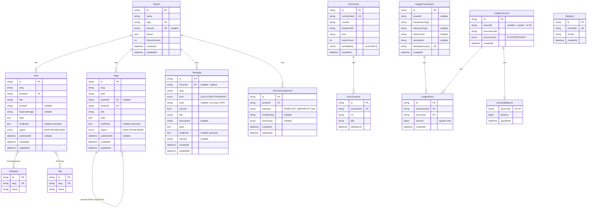

# Database ERD

Generated from `prisma/schema.prisma`. Renders natively on GitHub.

> Note: `LedgerAccount.tenantId` is a plain column with no Prisma relation to
> `Tenant` (system rows use `tenantId = null`), so it is not drawn as an edge.

