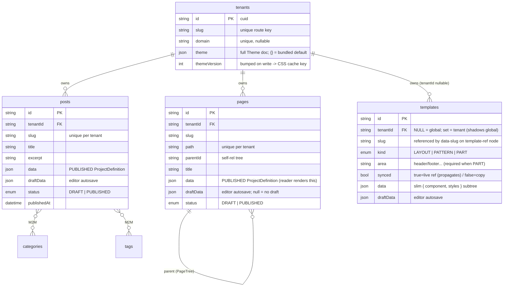
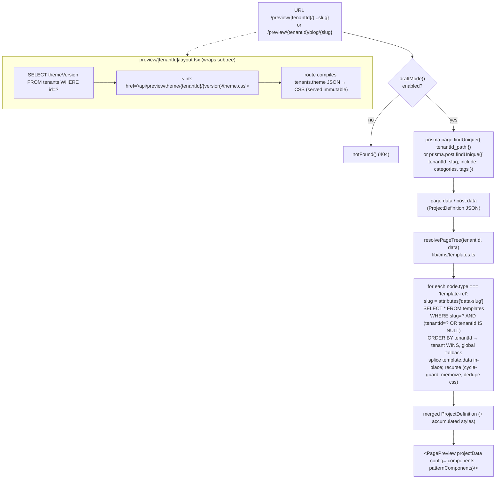
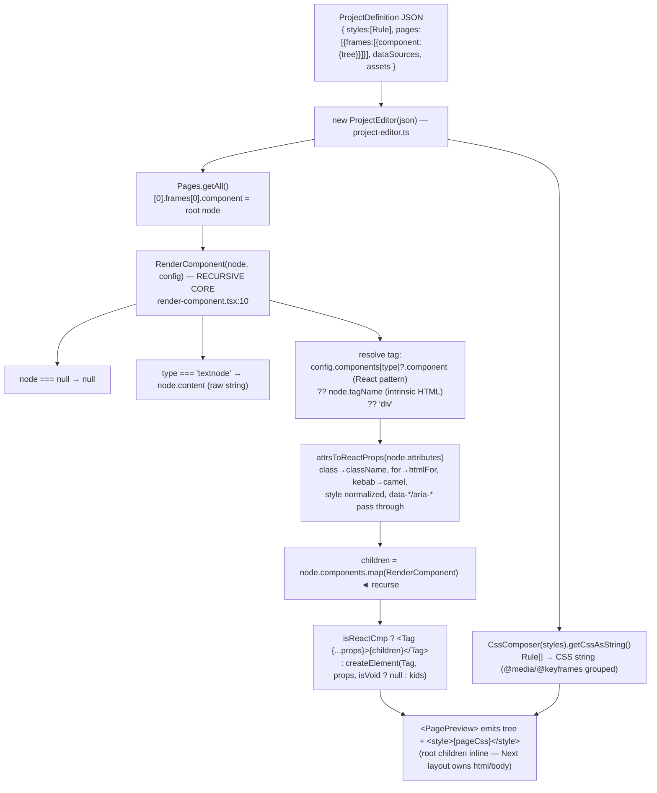

# Page / Post rendering pipeline

How a stored JSON document becomes rendered JSX — the App Router layout, the
database tables involved, template resolution, and the JSON→JSX renderer.

> The `preview/` tree is the **reader** side. The same renderer a separate
> public deployment will consume from this DB; here it is gated behind Next.js
> draft mode.

---

## App Router folder structure

```
app/
├── layout.tsx                          Root: ThemeProvider, <html suppressHydrationWarning>
│
├── admin/                              ── Editor / CMS dashboard (GrapesJS authoring) ──
│   ├── (shell)/tenants/[id]/
│   │   ├── pages/  posts/  library/  theme/    list + data-table views
│   └── (editor)/
│       ├── pages/[id]/edit/page.tsx    GrapesJS editor → autosaves to draftData
│       ├── posts/[id]/edit/page.tsx
│       └── templates/[id]/edit/page.tsx
│
├── api/preview/
│   ├── route.ts                        Enable draft mode → redirect to /preview/...
│   ├── exit/route.ts                   Disable draft mode → /admin
│   └── theme/[tenantId]/[version]/theme.css/route.ts   Compiled tenant theme CSS
│
└── preview/[tenantId]/                 ── Public-shaped render (draft-gated here) ──
    ├── layout.tsx                      Injects <link> to compiled theme CSS
    ├── [...slug]/page.tsx              Catch-all → renders a PAGE
    └── blog/
        ├── page.tsx                    Post index list
        └── [slug]/page.tsx             Renders a single POST
```

The route groups `(editor)` vs `(shell)` split the GrapesJS authoring surface
from the dashboard chrome without affecting URLs.

---

## Database tables & columns



**The key column split:** `data` is the published JSON the reader renders;
`draftData` is the in-progress editor autosave. The editor seeds from
`draftData ?? data`; the public render reads **`data` only**. Publish writes
`draftData → data` and clears the draft.

---

## Request → render data flow



---

## JSON → JSX conversion (the renderer)

`lib/plugins/react-renderer/` turns the stored `ProjectDefinition` into React
elements — **no GrapesJS at runtime.**



### Pattern components

The map that makes "JSON → real React component" work is **`patternComponents`**
(`lib/plugins/patterns/index.ts`): `type → { component, props(), allowChildren }`.

A node like:

```jsonc
{ "type": "cta-section",
  "attributes": { "data-primary-label": "Get started" },
  "components": [ /* textnodes */ ] }
```

looks up `CtaSection`, its traits become typed props, and its GrapesJS children
render as JSX `children`. Any node **without** a registered type falls back to
its raw `tagName`, so plain markup round-trips as ordinary HTML elements.

---

## Pinned GrapesJS internals (check on upgrade)

The canvas half of `lib/plugins/react-renderer/` reaches into GrapesJS
internals that are **not part of the public API**. Pinned against
**grapesjs 0.22.16** — re-verify each on any GrapesJS upgrade:

- **`Components.config.processor` result is shallow-merged as a single
  object** (`processDef` → underscore `extend`). The processor can never
  return an array, so a transparent Fragment that flattens to multiple
  children must be collapsed at the call site (`index.ts`): one child →
  the child; zero/multi → `{ components }` (materializes a default
  container — accepted limitation). `process.ts` / `index.ts`.
- **`Parser.parserHtml.splitPropsFromAttr(rest)`** splits a prop bag into
  `{ attrs, props }` (HTML attributes vs model-level props). `process.ts`.
- **`Components.ComponentView` + `.extend(...)`** — bind.ts subclasses the
  view to adopt React-owned DOM (overriding `initComponents`,
  `_createElement`, `_removeElement`, `__clearAttributes`, `render`, and
  calling `_ensureElement` / `_setData` / `renderAttributes` /
  `updateSrc`). `bind.ts`.
- **Backbone `setElement` reliance** — the existing-view rebind path calls
  `view.setElement(el)` to undelegate/re-delegate handlers (notably
  `dragstart`). NOTE: `setElement` does **not** redo the constructor-only
  wiring of `el.__gjsv` / `$el.data('model')`; if hover/select ever breaks
  post-rebind, re-add those in the else branch with evidence. `bind.ts`.
- **`ComponentView.frameView`** getter (= `opts.config.frameView`) — used
  for frame-scoped view teardown (`v.frameView === frameView`).
  `render-component.tsx`, `bind.ts`.
- **`Components.events`** keys (`update`, `removed`, plus the
  `update:components|attributes|classes` sub-events) drive the canvas
  re-render/teardown subscriptions. `render-component.tsx`.
- **`Canvas.config.customRenderer`** props shape — the per-frame render
  entry point the plugin installs. `index.ts`, `render-root`.

## One-line summary

`data` (JSON) → `ProjectEditor` parses it → `template-ref` nodes resolved from
the `templates` table → `RenderComponent` recurses the tree, mapping each node's
`type` to either a registered React pattern component or its HTML `tagName`,
converting `attributes`→props and `styles`→a CSS string → React renders it as a
server component.
