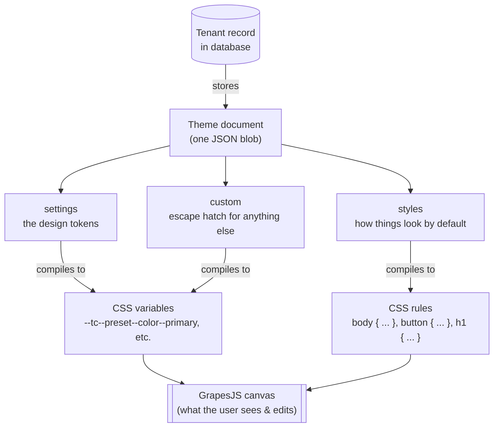
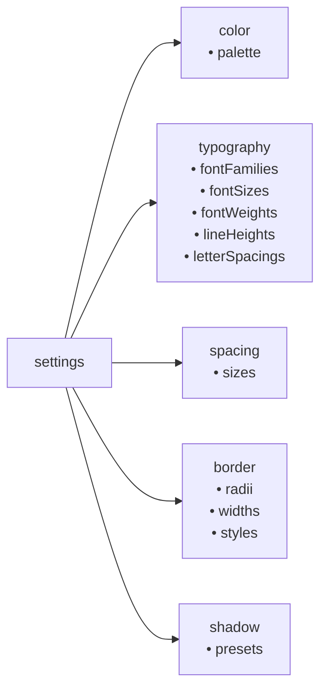
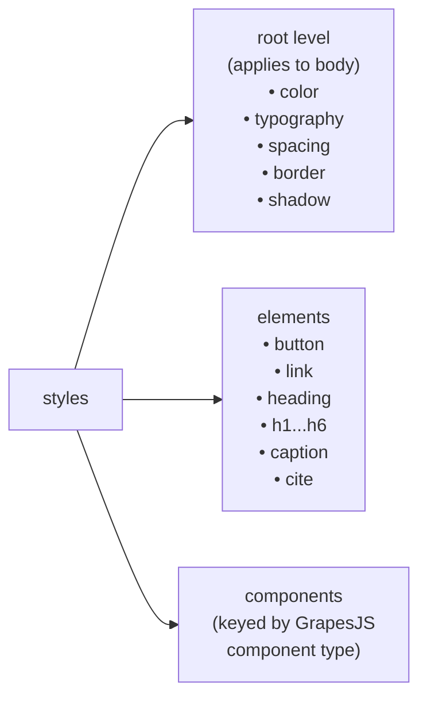
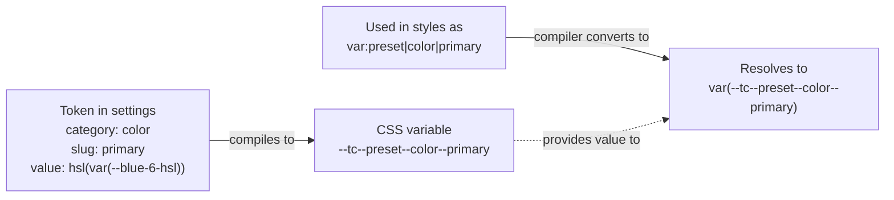
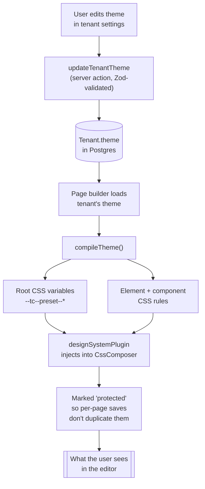

# The Theme Document

A guide to how Tripcart stores and applies a tenant's brand.

## What is it?

A **theme document** is a single JSON object that describes everything about how a tenant's pages should look — their colors, fonts, spacing, default button styles, heading styles, and so on.

One theme lives on each tenant. Every page or post that tenant creates automatically inherits from it.

It's modeled after WordPress's `theme.json`, so if you've worked with WP block themes the shape will feel familiar.

## The big picture



## The two halves

A theme has two main sections that do different jobs.

### 1. `settings` — the design tokens

This is the **registry of raw ingredients**. Think of it like a paint palette: a list of named colors, font families, spacing sizes, shadow recipes, etc. Settings don't apply any styling on their own — they just define what's available.



Each entry in these categories is a **token** with three fields:

| field | what it is |
|-------|------------|
| `slug` | the stable ID (used in CSS variable names and references) |
| `name` | the human-readable label shown in the UI |
| `value` | the actual CSS value (e.g. `hsl(var(--blue-6-hsl))`) |

> **Heads up:** `name` is safe to rename. `slug` is **not** — changing it breaks every reference that points to it.

### 2. `styles` — how things look by default

This is where you say **"by default, buttons should look like X, headings like Y, the page background should be Z."** Styles reference tokens from `settings` rather than hard-coding values, so changing a token cascades everywhere it's used.



Each element or component block can also define hover, focus, active, and visited states.

## How a token becomes CSS

Tokens follow a predictable naming convention that mirrors WordPress, so the exported HTML is self-describing.



The general pattern: every preset becomes a CSS variable named `--tc--preset--<category>--<slug>`. Anything in the open-ended `custom` section becomes `--tc--custom--<path>--<segments>`.

## The full flow, end to end



The key insight: theme rules are tagged as `protected` when they're injected into the canvas. When a page saves, the `tc-local` storage adapter filters those protected rules out — so the tenant's brand CSS lives in **one** place (the tenant record) instead of being copy-pasted into every page's save blob.

## Where the theme gets loaded

Two routes consume `Tenant.theme`. Both follow the same pattern: load on the server, push into `themeStore` on mount, and let the existing subscribers (`designSystemPlugin`, `useApplyThemeVars`) cascade the change to the canvas and the outer document.

| Surface | Route | What it does |
|---|---|---|
| **Tenant settings** | `/admin/tenants/[id]/theme` | Mounts `<TenantThemeEditor>` for editing. Save commits via `updateTenantTheme` server action. |
| **Page builder** | `/admin/pages/[id]/edit` and `/admin/posts/[id]/edit` | Read-only consumer. Resolves `tenantTheme = await getTenantTheme(record.tenantId)` on the server, passes it to `<EditorShell>` as a prop, and the shell calls `themeStore.setTheme(tenantTheme)` on mount so the canvas renders with the tenant's brand. |

Theme editing is intentionally **only** available on the tenant settings route — the page builder's left sidebar is for content (blocks + layers), not brand. This keeps per-page edits scoped to per-page CSS rules and prevents one tenant's draft mutations from leaking into another's editor session.

## A minimal example

```json
{
  "version": 1,
  "settings": {
    "color": {
      "palette": [
        { "slug": "primary", "name": "Primary", "value": "hsl(var(--blue-6-hsl))" },
        { "slug": "primaryForeground", "name": "Primary Foreground", "value": "hsl(var(--gray-0-hsl))" }
      ]
    },
    "typography": {
      "fontFamilies": [
        { "slug": "body", "name": "Body Font", "value": "var(--font-sans)" },
        { "slug": "heading", "name": "Heading Font", "value": "var(--font-sans)" }
      ]
    },
    "border": {
      "radii": [
        { "slug": "md", "name": "Medium", "value": "var(--radius-2)" }
      ]
    }
  },
  "styles": {
    "color": {
      "text": "var:preset|color|foreground",
      "background": "var:preset|color|background"
    },
    "typography": {
      "fontFamily": "var:preset|typography|fontFamilies|body"
    },
    "elements": {
      "button": {
        "color": {
          "text": "var:preset|color|primaryForeground",
          "background": "var:preset|color|primary"
        },
        "border": {
          "radius": "var:preset|border|radii|md"
        }
      },
      "heading": {
        "typography": {
          "fontFamily": "var:preset|typography|fontFamilies|heading",
          "fontWeight": "var:preset|typography|fontWeights|bold"
        }
      }
    }
  }
}
```

This compiles down to: a `:root` rule with all the preset variables, a `body { ... }` rule that picks up the page-level defaults, and `button { ... }` / `h1...h6 { ... }` rules with the per-element styles.

## Why this shape?

- **One source of truth per tenant.** Brand changes apply everywhere instantly, instead of needing to re-edit each page.
- **Tokens are separate from styles.** You can change a preset (say, "make Primary purple") without touching any of the rules that reference it.
- **Familiar naming.** Following WordPress conventions makes the exported HTML readable and lets us borrow patterns from a well-tested ecosystem.
- **Open-ended where it matters.** The `components` section is keyed by GrapesJS component type — new patterns can ship with their own default styling without a schema bump.

## Where to look in code

| concern | file |
|---------|------|
| The TypeScript type | `lib/theme/schema.ts` |
| Runtime validation | `lib/theme/schema.zod.ts` |
| Compiling theme → CSS | `lib/theme/compile.ts` |
| Bundled defaults | `lib/tokens/index.ts` |
| Reading/writing on the tenant | `lib/cms/tenants.ts`, `lib/cms/tenant-actions.ts` |
| Injecting into the canvas | `lib/plugins/design-system-plugin.ts` |
| Filtering theme rules out of per-page saves | `lib/plugins/tc-storage-adapter.ts` |
